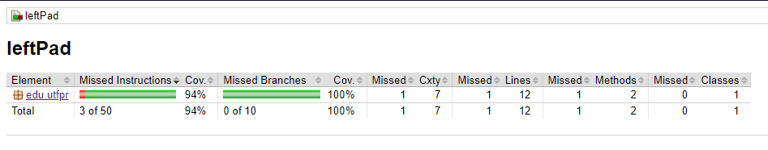
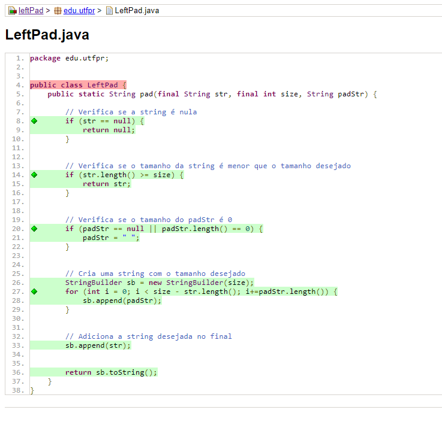
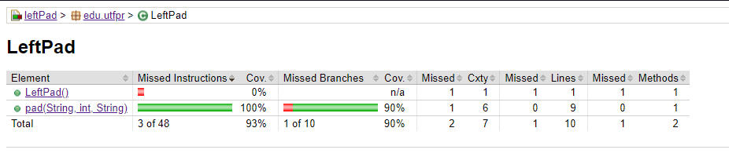
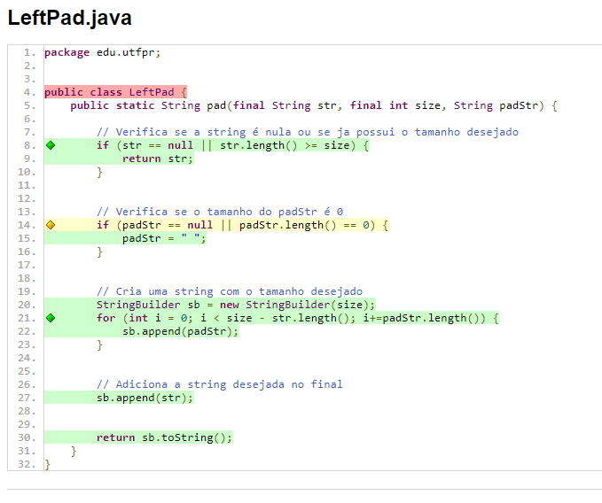

```{css}
#| echo: false
ul,
p {
  text-align: justify !important
}
```


# Parte 1 - Teste de Software Baseado em Especificação

## Introdução

Este relatório descreve o processo do projeto 2, criação de testes automatizados e visualização de cobertura(jacoco) e tabelas verdades de condições(MD/MC). Este processo é feito sobre a função LeftPad(), a qual consiste no preenchimento de uma string, à esquerda do conteudo existente, com caracteres de outra string ate completar um comprimento determinado na chamada da função.


## Passo 3 - Identificar as partições

### Para cada entrada individualmente

#### Parâmetro ``str``: 
  
Os parãmetro ``str`` é uma variave do tipo string que será usada de base para o preenchimento. Esta variável pode possuir as seguintes caracteristicas:

- ``str`` === ``null``;
- ``str`` === [](vazio);
- ``len(left) > 1``.


#### Parâmetro ``size``: 
  
Os parãmetro ``size`` é uma variave do tipo int que representa o tamanho da string resultante desejada. Esta variável pode possuir as seguintes caracteristicas:

- ``size < 0``;
- ``size == 0``;
- ``size > 0``.


#### Parâmetro ``padStr``: 
  
Os parãmetro ``padStr`` é uma variave do tipo string que será usada de padrão para o preenchimento. Esta variável pode possuir as seguintes caracteristicas:

- ``padStr == null`` || ``padStr == [](vazio)``;
- ``len(padStr) == 1``;
- ``len(padStr) > 1``.


### Para combinações de entradas

Nesta etapa, vamos considerar dois fatores, como uma entrada afeta outra, e a quantidade de combinações possíveis para realização de testes. Vamos começar considerando que a segunda entrada ``size`` irá adicionar mais casos de testes à primeira entrada ``str``, pois elas estão totalmente ligadas, esta ligação é sobre o comprimento da entrada ``str`` precisar ser preenchida ou nao para satisfazer o método estudado. Com isto vamos adicionar mais aguns testes que relacionam o comprimento da entrada ``str`` com o valor da estrada ``size``: 
- ``len(str) < size``;
- ``len(str) == size``;
- ``len(str) > size``.

Com isto temos todas as possibilidades, intuitivas e lógicas, para o método estudado, então vamos calcular a quantidade de casos de teste possíveis, sendo 3 para cada entrada, o que nos dá ``3 x 3 x 3 = 27`` casos de teste possíveis, mas ainda podemos adicionar os casos relatados neste item do relatório, que são 3 casos de teste que relacionam 2 entradas, e cada entrada possui 3 possibilidades, o que nos dá ``3 x 3 x 3 = 27`` casos de teste possíveis, totalizando ``27 + 27 = 54`` casos de teste possíveis.


### Para saídas esperadas

Por fim vamos analisar as possíveis saídas do método, neste caso é simples, pois a saída é uma string, e a única coisa que pode variar é o comprimento da string com base na string base, que pode ser: ``null``; string base, caso não haja necessidade de preenchimento; string base preenchida à esquerda. Com isto temos 3 possibilidades para a saída esperada:

- ``null``;
- string base;
- string base preenchida à esquerda.


## Passo 4 - Identificar os valores limite

Agora vamos verificar os valores limites destas entradas, a primeira entrada possui valores limites já contemplados nos casos de teste citados anteriormente. Assim como a primeira entrada, a terceira já possui os valores limites contempladas nos casos de teste citados anteriormente. Mas a segunda entrada, que é um inteiro, possui valores limites que não foram explicitados, eles são: ``size == -1``, ``size == 0`` e ``size == 1``. Com isto temos mais 2 casos de teste, que serão adicionados aos casos de teste já existentes, totalizando ``54 + 2 = 56`` casos de teste possíveis.


## Passo 5 -  Derivar os casos de teste

Nesse momento vamos estudar as combinações das entradas, para verificar quais os testes são validos, quais deles iremos implementar, pois os demais serão descartados. Vamos começar com a primeira entrada, a qual possui 1 valore que independe das demais entradas, que é: ``str==null``. Já as demais entradas, podem ser combinadas com a segunda entrada. Até aqui temos 1 caso de teste independente, e mais 2 casos de teste que podem ser combinados com os 3 casos de teste da segunda entrada. Somando 1 caso inependente mais 6 casos combinados: ``1 + 6 = 7`` casos de teste possíveis.

Para a segunda entrada temos que as 3 partições são independentes das demais entradas, necessitando apenas que a primeira entrada não seja ``nul``. Com isto a segunda entrada já foi contemplada com os casos de teste da primeira entrada. Por fim todos as partições da última entrada apenas tem uso em duas combinações das entradas anteriores:
- ``str === [](vazio)``,  ``len(str) < size``, ``size > 0``;
- ``len(str) > 1``,  ``len(str) < size``, ``size > 0``.


Com isto temos 3 possibilidades para a terceira entrada, que pode ser combinada com os 2 casos citados acima, totalizando ``3 x 2 = 6`` casos de teste possíveis. Com isto temos ``7 + 6 = 13`` casos de teste possíveis, que são:


- Testes de entrada ``str``:
  - T01: ``str==null``;

- Testes de entrada ``str`` e ``size``:
  - T02: ``str == []``, ``size < 0``;
  - T03: ``str == []``, ``size == 0``;
  - T04: ``str == []``, ``size > 0``;
  - T05: ``len(str) > 1``, ``size < 0``;
  - T06: ``len(str) > 1``, ``size == 0``;
  - T07: ``len(str) > 1``, ``size > 0``;

- Testes de entrada ``str``, ``size`` e ``padStr``:
  - T08: ``str == []``, ``len(str) < size``, ``size > 0``, ``padStr == []``;
  - T09: ``str == []``, ``len(str) < size``, ``size > 0``, ``padStr == null``;
  - T10: ``str == []``, ``len(str) < size``, ``size > 0``, ``len(padStr) == 1``;
  - T11: ``str == []``, ``len(str) < size``, ``size > 0``, ``len(padStr) > 1``;
  - T12: ``len(str) > 1``, ``len(str) < size``, ``size > 0``, ``padStr == []``;
  - T13: ``len(str) > 1``, ``len(str) < size``, ``size > 0``, ``padStr == null``;
  - T14: ``len(str) > 1``, ``len(str) < size``, ``size > 0``, ``len(padStr) == 1``;
  - T15: ``len(str) > 1``, ``len(str) < size``, ``size > 0``, ``len(padStr) > 1``.


  

## Passo 6 - Automatizar os casos de teste usando JUnit

Por fim vamos automatizar os casos de teste, para isto vamos criar uma classe de teste, a qual irá conter todos os casos de teste citados anteriormente.


# Parte 2 - Teste de Software Baseado em Estrutura

## Passo 3 - Visualizar a cobertura de código com Jacoco

Agora vamos visualizar a cobertura de código com Jacoco, para isto vamos executar os testes automatizados e verificar a cobertura de código. Para isto vamos executar o comando ``mvn clean test`` e em seguida ``mvn jacoco:report``. Com isto será gerado um relatório de cobertura de código por linha, o qual podemos ver a seguir:





Podemos ver que a cobertura de código foi extremamente alta e satisfatória, o que indica que a maioria dos caminhos possíveis do código foram testados, mas não podemos afirmar que não existem bugs, pois a cobertura de código não é uma garantia de ausência de bugs, mas sim uma garantia de que a maioria dos caminhos possíveis foram testados.


## Passo 4 - Visualizar a tabela verdade das condições com MD/MC

Agora vamos realizar o estudo de testes utilizando o método teste de software baseado em estrutura, o qual se baseia em decisão de múltiplas condições. Para isto vamos usar os critério MS/MC para criar uma tabela verdade das condições, a qual será usada para criar os casos de teste. O método estudado possui 2 estrutura de condições ``if``, e uma estrututura de condição ``for``, que são, respectivamente:

- ``if (str == null || str.length() >= size)``;
- ``if (padStr == null || padStr.length() == 0)``;
- ``for (int i = 0; i < size - str.length(); i++)``.


Vamos analisar e mmontar as tabelas verdade das condições para cada estrutura de condição, e em seguida criar os casos de teste baseados nestas tabelas verdade das condições.


### Tabela verdade da condição 1

| Teste | str == null | str.length() >= size | resultado |
|:-----:|:-----------:|:--------------------:|:---------:|
| T1    | true        | true                 | true      |
| T2    | true        | false                | true      |
| T3    | false       | true                 | true      |
| T4    | false       | false                | false     |

: Tabela MD/MC Condicao 1


#### Pares de Dependência ``str == null``
Pares que possuem as mesmas condições, variando apenas a condição ``str == null``:
- ``{T1 e T3}``;
- ``{T2 e T4}``.


#### Pares de Dependência ``str.length() >= size``
Pares que possuem as mesmas condições, variando apenas a condição ``str.length() >= size``:
- ``{T1 e T2}``;
- ``{T3 e T4}``.


#### Junção dos pares de dependência
Junção dos pares de dependência, criando a lista de testes que serão realizados:
- ``{T1 e T3}``;
- ``{T1 e T2}``;

Lista de testes que serão realizados:
- ``{T1, T2, T3}``;


### Tabela verdade da condição 2

| Teste | padStr == null | padStr.length() == 0 | resultado |
|:-----:|:--------------:|:--------------------:|:---------:|
| T1    | true           | true                 | true      |
| T2    | true           | false                | true      |
| T3    | false          | true                 | true      |
| T4    | false          | false                | false     |

: Tabela MD/MC Condicao 2


#### Pares de Dependência ``padStr == null``
Pares que possuem as mesmas condições, variando apenas a condição ``padStr == null``:
- ``{T1 e T3}``;
- ``{T2 e T4}``.


#### Pares de Dependência ``padStr.length() == 0``
Pares que possuem as mesmas condições, variando apenas a condição ``padStr.length() == 0``:
- ``{T1 e T2}``;
- ``{T3 e T4}``.


#### Junção dos pares de dependência
Junção dos pares de dependência, criando a lista de testes que serão realizados:
- ``{T1 e T3}``;
- ``{T1 e T2}``;

Lista de testes que serão realizados:
- ``{T1, T2, T3}``;


### Tabela verdade da condição 3

| Teste | i < size - str.length() | resultado |
|:-----:|:-----------------------:|:---------:|
| T1    | true                    | true      |
| T2    | false                   | false     |

: Tabela MD/MC Condicao 3


#### Pares de Dependência ``i < size - str.length()``
Pares que possuem as mesmas condições, variando apenas a condição ``i < size - str.length()``:
- ``{T1 e T2}``.


### Casos de teste baseados nas tabelas verdade das condições

Com as tabelas verdade das condições prontas, vamos criar os casos de teste baseados nestas tabelas verdade das condições, que são:

- Testes de entrada ``str == null`` e ``str.length() >= size``:
  - T01: ``str == null`` e ``str.length() >= size``; 
  - T02: ``str == null`` e ``str.length() < size``;
  - T03: ``str != null`` e ``str.length() >= size``;

- Testes de entrada ``padStr == null`` e ``padStr.length() == 0``:
  - T04: ``padStr == null`` e ``padStr.length() == 0``; 
  - T05: ``padStr == null`` e ``padStr.length() != 0``;
  - T06: ``padStr != null`` e ``padStr.length() == 0``;

- Testes de entrada ``i < size - str.length()``:
  - T07: ``i < size - str.length()``;
  - T08: ``i >= size - str.length()``.


  ## Passo 5 - Visualizar a cobertura de código com Jacoco

Agora vamos visualizar a cobertura de código com Jacoco, para isto vamos executar os testes automatizados e verificar a cobertura de código. Para isto vamos repetir os comando ``mvn clean test`` e em seguida ``mvn jacoco:report``. Com isto será gerado um relatório de cobertura de código por linha, o qual podemos ver a seguir:



